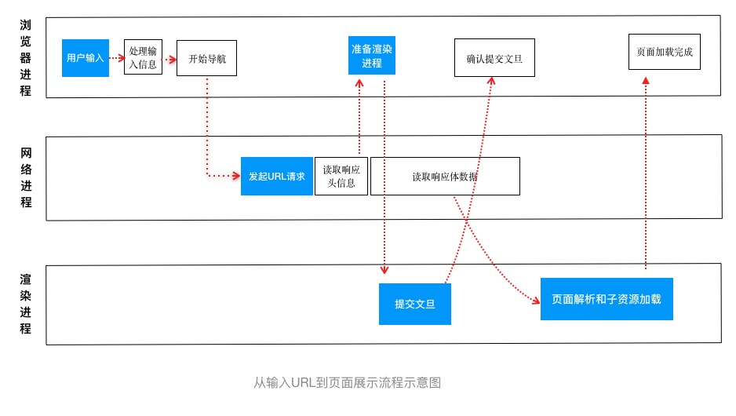

## chrome架构

因为市面上大部分浏览器是基于google开源的[chromium](https://zh.wikipedia.org/wiki/Chromium)开发的，而chrome作为Google的官方浏览器，特性和Chromium 基本一样，所以拿它举例。

看一下最新chrome 的架构图：

- 浏览器进程—— 主要负责界面显示、用户交互、子进程管理，同时提供存储服务。
- 网络进程—— 提供网络资源加载。
- GPU进程—— 绘制UI。
- 渲染进程—— 一个页面一个渲染进程，用来将HTML、CSS 和 JavaScript 转换为用户可与之交互的网页，排版引擎Blink和JavaScript引擎V8都是在这个进程中，安全起见运行在沙盒模式，也就是限制了系统级API调用，不能操作本地文件。
- 插件进程—— 隔离插件对页面的影响

使用过Chrome浏览器的人经常会遇到一个问题，太占内存。页面开的越多，内存就哗哗哗的上去了。这是因为进程开的多，没有进程都有公共执行环境的副本。那么，咱们做成单进程不好吗？

事实上，早些年浏览器就是单进程架构。网络、插件、javascript运行环境、渲染等都是一个进程里的不同线程。遇到了一些问题：不稳定、不流畅、不安全。你不想在给客户写了一半邮件的时候因为插件运行错误导致浏览器卡死了吧，不想在看一个激情网站的时候被盗取密码了，不想看页面一抖一抖地展示画面吧。

因为有问题存在，所以有了解决方案——多进程。

不稳定没了。因为进程隔离，你挂了不影响我啊。
不流畅少了。UI渲染的任务分担出去了，不会因主线程阻塞总是卡顿。
不安全少了。插件隔离，避免引发安全问题。

Chrome的官方团队为了解决现有的问题：1-占用资源高，吃内存，2-架构复杂，扩展性差。近些年又在往“面向服务的架构”（Services Oriented Architecture,简称**SOA**）方面转变。

如图：

把一些通用能力提取成公共的了，比如video进程、设备进程，解决目前每个渲染进程都携带一套执行环境副本的内存状况，架构上也更灵活了。

这个转变得个几年时间，目前是在过渡期。

谈谈为什么会出现这种转变。

一句话，需求倒逼产品升级。
早以前浏览器不具备太多能力，也就浏览浏览网页，写邮件、业务流程办公、打游戏都有专门的软件，C/S架构比较多。
经过这些年的进化，为更好满足人们便捷性的需求，浏览器的能力得到了扩展，现在连视频会议、PS都可以网页满足，许多办公软件也都是网页化的，B/S 架构越来越多。
需求多了，对浏览器的要求也多了，浏览器是不是变成了新一代的Windows？

## 网络

又个概念，FP（First Paint）,是指页面加载到首次绘制的时间。这个指标直接影响着用户跳出率，十分重要。影响这个指标的关键是网络加载速度。

浏览器是基于HTTP协议传输数据的，关于HTTP协议的知识很容易找到，这里略过。

记得，浏览器的网络进程会提供基本能力。比如，收到301的响应该如何处理。什么时候走缓存、什么时候走服务器获取、缓存DNS的策略、如何处理set-cookie等。

## 从输入URL到页面展示，这中间发生了什么

如图

大概就是这么个过程：

首先用户在地址栏输入，浏览器判断输入内容不是地址类型的话就会使用搜索引擎构造一个地址。

有了地址就交给网络进程来处理，构造请求，这里有个浏览器缓存策略。如果命中，则返回结果，否则发起http请求。

收到响应头之后就开始准备接收文档了，此时，浏览器界面开始发生变化。

收到响应体之后，页面进入解析和渲染阶段，最终页面加载完成。

把从用户发出url到页面开始解析，叫做 导航流程，接下来说说 在收到响应体之后，也就是有了html之后如果展示成页面的过程，叫 渲染流程。

构建网页的资源有三种类型的文本，
html 超文本标记语言 、
css 层叠样式表、
js javascript,可用来修改内容，是网页动起来。

首先是DOM树的构建。

其次是把css转成stylesheet,浏览器能理解的结构。

再次，结合DOM和stylesheet,构建布局树。

接下来，分层，拥有层叠上下文属性的元素会被提升为单独的一层，例如有 position:fixed,z-index:1,filter:blur(1px),opacity:.5等，参见[MDN层叠上下文](https://developer.mozilla.org/zh-CN/docs/Web/Guide/CSS/Understanding_z_index/The_stacking_context)

接下来，图层绘制，就是生成绘制指令，提给合成线程。

再然后，栅格化操作。把文本指令交给合成线程，线程又讲图层分成图块，视窗近的图块优先生成位图。生成位图过程也叫栅格化，经常借助GPU快速栅格化。图块栅格化之后，合成线程就会生成绘图指令，提交给浏览器进程。再绘制到内存中，显示在屏幕上。

