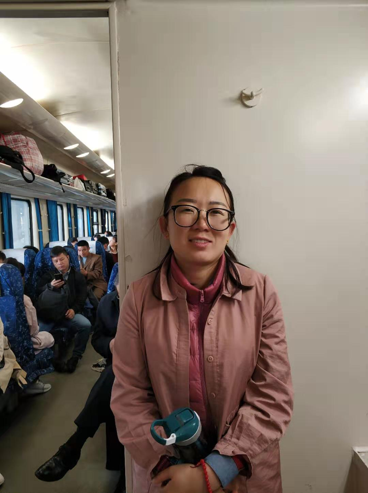
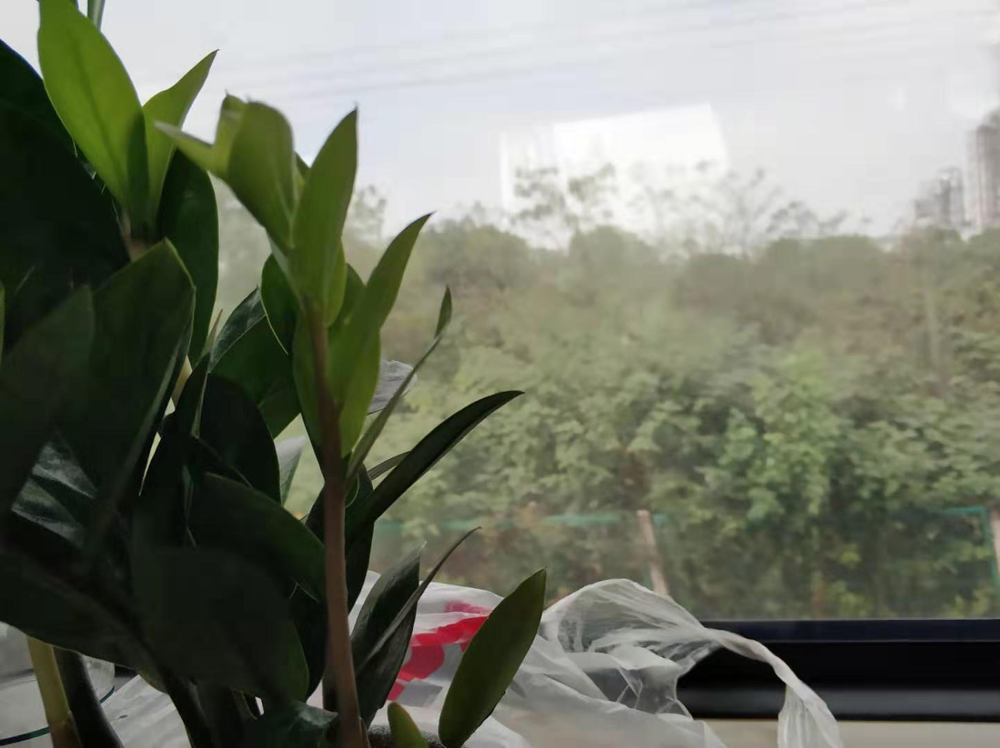
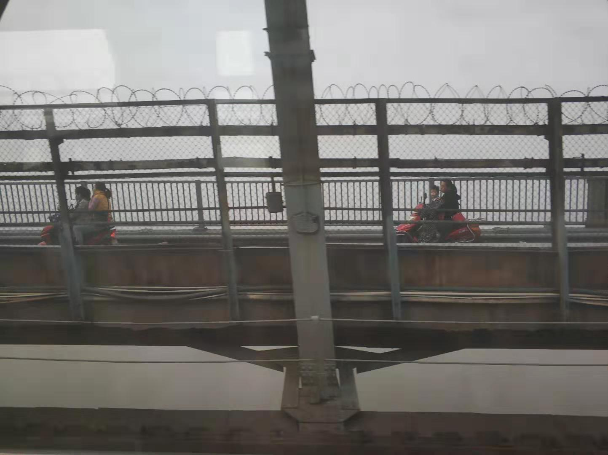
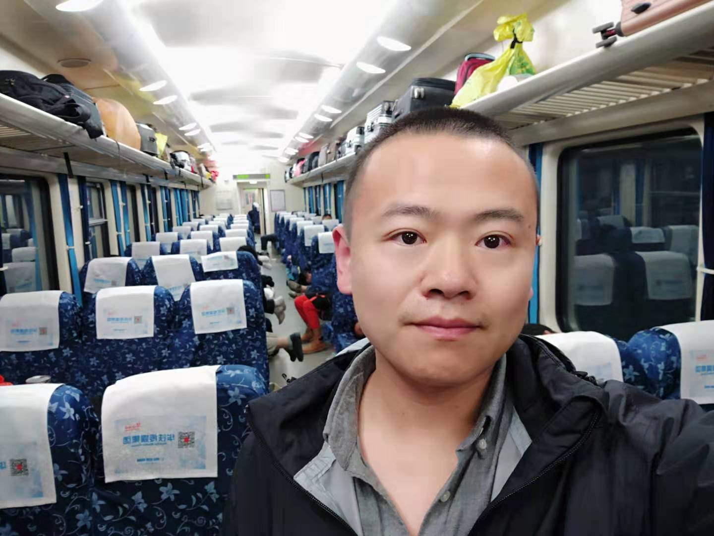
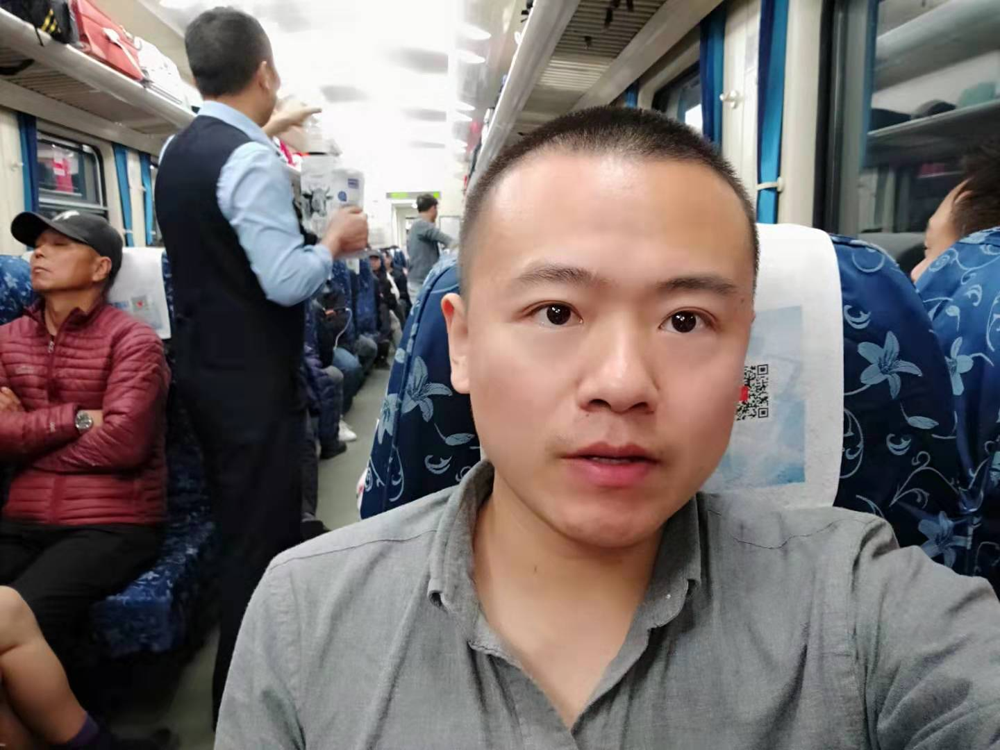
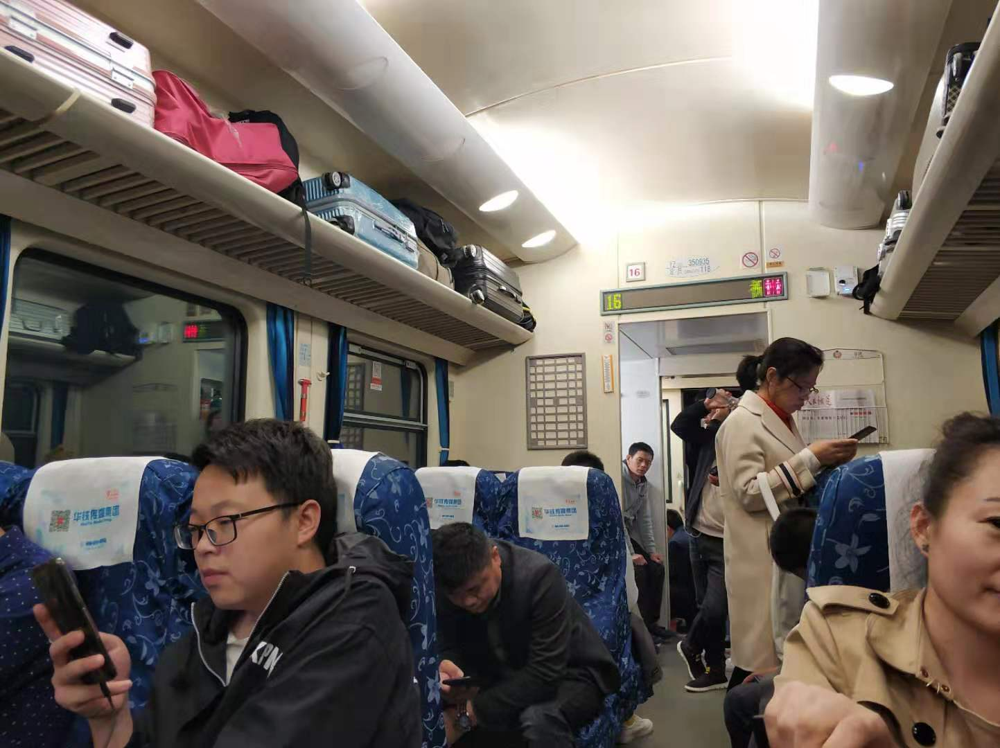

## 董小姐  

### 退卡
九月份给我两办了健身卡，想着是一周游泳几次，如果工作变动，转卡就行，反正价格看起来合适，2200/两年。

游泳场馆没有在十月份如口头说的日期开业。

工作没了，要离开北京了。董小姐坚持要把卡退了，因为一次也没去过。我则认为用两个月时间转，总会转出去的。

我两去了场馆，找销售经理聊，对方是个北漂十年的阳泉人，董小姐陈述游泳馆没开（坚持对方爽约），我们工作变动，家里老人得了癌症，小孩在家（不知道她还能编出这个），坚持退卡。看出来对方经理犹豫了许久许久（能看出她静坐了好久），最后坚持试营业阶段不受理退款。

后来当时销售卡的人员来了，董小姐火气大的拍了桌子，以上面的理由发怒，说道老人得病，眼睛有些湿润声音有些发哑，比真的还真的感觉。

公司坚持不退的情况下，董小姐打工商投诉电话。

最终，出于私下里的原因，退了。

### 做了一天火车

是的，22小时的普通火车，我们到了深圳。

一路上聊天的有：
从非洲埃尔及利亚呆了两年刚回国的货车司机
高中辍学父母在深圳打工的准备去深圳找找工作的99年小伙
做快递的93年河北小兄弟
建设信号塔的大哥描述如何搭建信号塔
44年出生的大爷热切地讲着他的故事
承包工程的河北大哥
列车上的销售员顽强地销售着新疆梅子和内蒙古奶酪片

